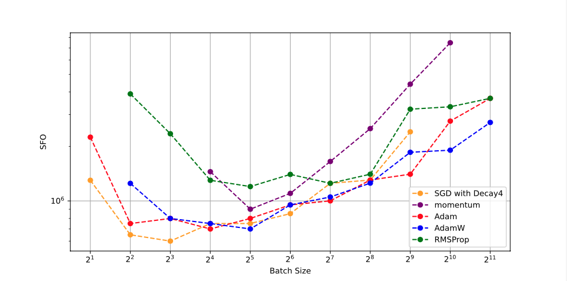
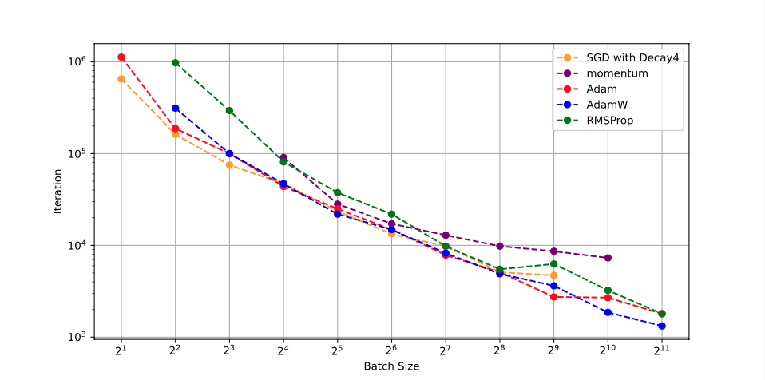
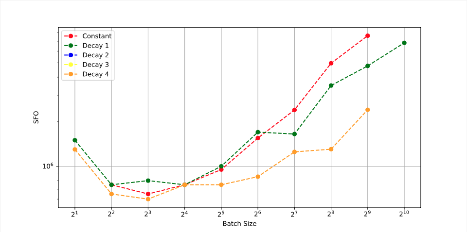
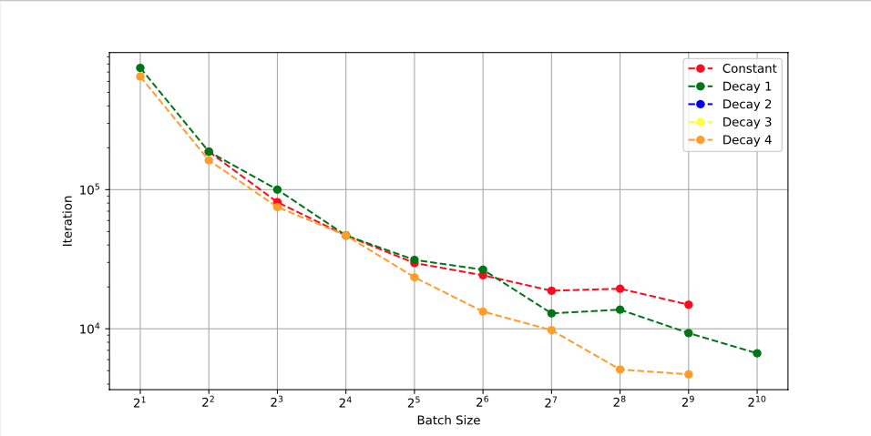

# SGD_with_decaying
This code was used for experiments with Iteration and Stochastic First-order Oracle Complexities of Stochastic Gradient Descent using Constant and Decaying Learning Rates

The performance of stochastic gradient descent (SGD), which is the simplest first-order optimizer for training deep neural networks, depends on not only the learning rate but also the batch size. They both affect the number of iterations and the stochastic first-order oracle (SFO) complexity needed for training. In particular, the previous numerical results indicated that, for SGD using a constant learning rate, the number of iterations needed for training decreases when the batch size increases, and the SFO complexity needed for training is minimized at a critical batch size and increases once the batch size exceeds that size. 

This paper studies the relationship between batch size and the iteration and the SFO complexities needed for nonconvex optimization in deep learning with SGD using constant/decay learning rates. We show that SGD using a step-decay learning rate and a small batch size reduces the SFO complexity to find a local minimizer of a loss function. We also provide numerical comparisons of SGD with the existing first-order optimizers and show the usefulness of SGD using a step-decay learning rate and a small batch size.

Figure 1: SFO complexity needed for SGD with (Decay4), momentum, Adam, AdamW, and RMSProp to achieve a test accuracy of 0.9 versus batch size (WideResNet-28-10 on CIFAR-10)

Figure 2: Number of iterations needed for SGD with (Decay4), momentum, Adam, AdamW, and RMSProp to achieve a test accuracy of 0.9 versus batch size (WideResNet-28-10 on CIFAR-10)

Figure 3: SFO complexity needed for SGD with (Constant), (Decay 1), (Decay 2), (Decay 3), and (Decay 4) to achieve a test accuracy of 0.9 versus batch size (WideResNet-28-10 on CIFAR-10)

Figure 4: Number of iterations needed for SGD with (Constant), (Decay 1), (Decay 2), (Decay 3), and (Decay 4) to achieve a test accuracy of 0.9 versus batch size (WideResNet-28-10 on CIFAR-10)

We trained not only ResNet-18 but also WideResNet-28-10 on CIFAR-10 dataset. The stopping condition and value of hyperparameters used in training WideResNet-28-10 are the same as ones used in training ResNet-18.
